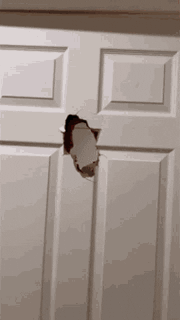

<h1 align="center">Hi 👋, I'm Mete</h1>

<h3 align="center">I work with computers?</h3>

 

- `whoami` Final-year bachelor's student at TU Delft
- `pwd` Delft, Netherlands
- `ps -a` Building cool things
- `uname -n` Check out my website [mete.run](https://mete.run)

 

### NOM NOM:

<picture>
  <source media="(prefers-color-scheme: dark)" srcset="https://raw.githubusercontent.com/meteaksoyy/meteaksoyy/output/github-snake-dark.svg" />
  <source media="(prefers-color-scheme: light)" srcset="https://raw.githubusercontent.com/meteaksoyy/meteaksoyy/output/github-snake.svg" />
  
</picture>

 

### Connect with me:

 
